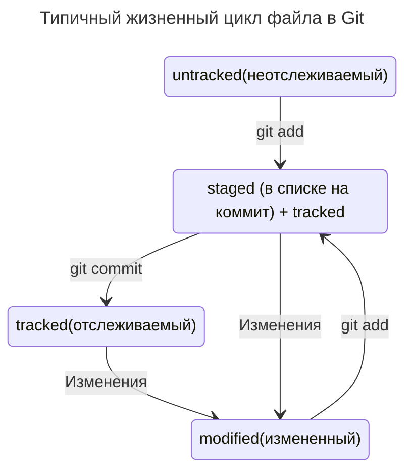

# Инструкция по созданию репозитория и связыванию его с удаленным репозиторием на [Github](https://github.com "github.com")

## 1. Делаем папку репозиторием. Для этого используется команда
```
git init
```

в папке которая будет являться папкой проекта.
---
## 2. Добавляем файлы в локальный репозиторий командой
```
git add .
```

_Точка *.* была выбрана как универсальный пример, т.к. добавит все файлы в  
выделенной папке. Можно добавлять файлы вручную командой `git add file_name`  
или же добавить все файлы `git add -all`._
----
_После добавления файлов можно проверить все ли прошло успешно командой_  
```
git status
```
---
## 3. Делаем коммит. **Команда**
```
git commit -m 'Мой первый коммит!'
```

_Здесь ключ `-m` означает 'message' после него пишется название как хотим 
назвать коммит._
---
## 4. Переходим на гитхаб и создаем удаленный репозиторий(кнопка 
`Repositories => New`)

Затем прописываем имя репозитория и описание, выбираем лицензию(опционально)
---
## 5. Связываем локальный и удаленный репозитории  

### Для этого находясь в корневой директории проекта выполняем команду
```
git remote add origin git@github.com:%ИМЯ_АККАУНТА%/first-project.git
```

_Убедиться, что репозитории связаны - `git remote -v`. Флаг -v здесь  
означает --verbose(от англ. подробный)_
---
## 6. Сонхронизируем локальный и удаленный репозитории
В первый раз эту команду нужно вызвать с флагом -u и параметрами origin  
(имя удалённого репозитория) и main или master (название текущей ветки).  
Флаг -u свяжет локальную ветку с одноимённой удалённой. Как вы связывали  
 локальный и удалённый репозитории в предыдущем уроке, так же и здесь  
нужно дополнительно связать ветки.
```
git push -u origin main
```
---
# **!!!Формат .md потому что Марк Даун!!!**


**Что такое хеш. Хеширование коммитов**  
-
### Хеширование (от англ. _hash_, «рубить», «крошить», «мешанина») — это способ 
преобразовать набор данных и получить их «отпечаток» (англ. _fingerprint_).  

Информация о коммите — это набор данных: когда был сделан коммит, содержимое 
файлов в репозитории на момент коммита и ссылка на предыдущий, или родительский 
(англ. _parent_), коммит.   

Git хранит таблицу соответствий `хеш → информация о коммите`. Если вы знаете 
хеш, вы можете узнать всё остальное: автора и дату коммита и содержимое 
закоммиченных файлов. Можно сказать, что хеш — основной идентификатор коммита.  

Все хеши и таблицу `хеш → информация о коммите` Git сохраняет в служебные 
файлы. Они находятся в скрытой папке `.git` в репозитории проекта.

# Лог
Рассмотрим подробнее, из каких элементов состоит описание коммита, а также как 
вывести сокращённый лог (от англ. _log_ — «журнал [записей]»). Сокращённый лог 
полезен, если нужно быстро найти нужный коммит среди сотни других.  

Команда  
```
git log
```
выводит список коммитов.  

Разберём элементы, из которых состоит описание:
строка из цифр и латинских букв после слова  
-
**_commit_** — это хеш коммита;  

**_Author_** — имя автора и его электронная почта;  

**_Date_** — дата и время создания коммита;  

в конце находится сообщение коммита.  

### Получить сокращённый лог — `git log --oneline`  

Получить сокращённый лог можно с помощью команды `git log` с флагом `--oneline` 
(_англ._ «одной строкой»). В терминале появятся только первые несколько 
символов хеша каждого коммита и их комментарии.  

Сокращённый лог полезен, если в репозитории уже много коммитов — например, 
сотни или тысячи. В этом случае можно быстро найти нужный по описанию.  

Сокращённый хеш (то есть первые несколько символов полного) можно использовать 
точно так же, как и полный. Для этого команда `git log --oneline` автоматически 
подбирает такую длину сокращённых хешей, чтобы они были уникальными в пределах 
репозитория и Git всегда мог понять, о каком коммите идёт речь.  

Обратите внимание: если выход из просмотра логов не произошёл автоматически, 
нажмите клавишу Q (от англ. _Quit_ — «выйти») в английской раскладке клавиатуры.
---

# HEAD  

При вызове команды `git log` вы также могли заметить надпись (HEAD -> master) 
после хеша одного из коммитов.  
Файл HEAD (_англ._ «голова», «головной») — один из служебных файлов папки .git. 
Он указывает на коммит, который сделан последним (то есть на самый новый).  
В этом можно убедиться с помощью терминала. Перейдите в папку .git командой `cd`. 
Посмотрите содержимое файла HEAD командой `cat`.  
Внутри HEAD — ссылка на служебный файл: `refs/heads/master` (или `refs/heads/main` 
в зависимости от названия ветки). Если заглянуть в этот файл, можно увидеть хеш 
последнего коммита.  
Когда вы делаете коммит, Git обновляет `refs/heads/master` — записывает в него хеш 
последнего коммита. Получается, что `HEAD` тоже обновляется, так как ссылается на 
`refs/heads/master`.  
При работе с Git указатель `HEAD` используется довольно часто. Мы уже упоминали, 
что многие команды Git принимают в качестве параметра хеш коммита. Если нужно 
передать последний коммит, то вместо его хеша можно просто написать слово 
`HEAD` — Git поймёт, что вы имели в виду последний коммит.  

# Статусы файлов в Git  

## Статусы `untracked`/`tracked`, `staged` и `modified`  

Одна из ключевых задач Git — отслеживать изменения файлов в репозитории. Для этого каждый файл помечается каким-либо статусом. Рассмотрим основные.
---
`untracked` (англ. «неотслеживаемый»)  
Мы говорили, что новые файлы в Git-репозитории помечаются как **untracked**, то есть неотслеживаемые. Git «видит», что такой файл существует, но не следит за изменениями в нём. У untracked-файла нет предыдущих версий, зафиксированных в коммитах или через команду `git add`.  

`staged` (англ. «подготовленный»)  
 После выполнения команды `git add` файл попадает в **staging** area (от англ. _stage_ — «сцена», «этап [процесса]» и _area_ — «область»), то есть в список файлов, которые войдут в коммит. В этот момент файл находится в состоянии **staged**.  

В одном из предыдущих уроков мы сравнили коммит с фотографией. Можно развить эту аналогию и сказать, что команда `git add` добавляет персонажей (текущее содержимое файла или нескольких файлов) на сцену (англ. _stage_) для общей фотографии, а `git commit` делает снимок всей сцены целиком.  

**💡 Staging area, index и cache
Staging area также называют index (англ. «каталог») или cache (англ. «кеш»), а состояние файла staged иногда называют indexed или cached.**
---

`tracked` (англ. «отслеживаемый»)  
Состояние `tracked` — это противоположность `untracked`. Оно довольно широкое по смыслу: в него попадают файлы, которые уже были зафиксированы с помощью `git commit`, а также файлы, которые были добавлены в **staging area** командой `git add`. То есть все файлы, в которых Git так или иначе отслеживает изменения.  

`modified` (англ. «изменённый»)  
Состояние `modified` означает, что Git сравнил содержимое файла с последней сохранённой версией и нашёл отличия. Например, файл был закоммичен и после этого изменён.  

💡 Для файлов в состояниях staged и modified обычно не указывают, что они также tracked, потому что это состояние подразумевается.
---

# Типичный жизненный цикл файла в Git  

Может показаться, что файлы в репозитории попадают в разные состояния хаотично. На практике это не так, и у большинства файлов вполне предсказуемый путь.  



1. Файл только что создали. Git ещё не отслеживает содержимое этого файла. Состояние: `untracked`.  
2. Файл добавили в staging area с помощью `git add`. Состояние: `staged` (+ `tracked`).  
   Возможно, изменили файл ещё раз. Состояния: **staged**, **modified** (+ **tracked**).  
   Обратите внимание: **staged** и **modified** у одного файла, но у разных его версий.  
   Ещё раз выполнили `git add`. Состояние: **staged** (+ **tracked**).  
3. Сделали коммит с помощью `git commit`. Состояние: **tracked**.  
4. Изменили файл. Состояние: **modified** (+ **tracked**).  
5. Снова добавили в staging area с помощью `git add`. Состояния: **staged** (+ **tracked**).  
6. Сделали коммит. Состояния: **tracked**.  
7. Повторили пункты 4 −7 4−7 много-много раз.
